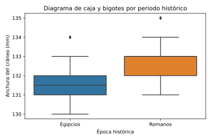

# Análisis Estadístico de la Evolución Craneal: Egipcios vs. Romanos

## 📋 Descripción del Proyecto
Este proyecto analiza si existen diferencias significativas en la anchura de cráneos (mm) encontrados en un yacimiento arqueológico, comparando dos periodos históricos:
1. **Predinástico Temprano (Egipcios)**
2. **Predinástico Tardío (Romanos)**

El objetivo es determinar estadísticamente si la morfología craneal cambió con el paso del tiempo, utilizando Python para el análisis descriptivo e inferencial.

## 🛠️ Tecnologías Utilizadas
* **Lenguaje:** Python
* **Librerías:** Pandas, Seaborn, Matplotlib, Scipy
* **Técnicas:** Test de Shapiro/Kolmogorov-Smirnov, Test de Levene, T-Student, Intervalos de Confianza.

## 📊 Resultados Clave

### Visualización de la Distribución

*El gráfico muestra un ligero aumento en la mediana de la anchura craneal en el periodo tardío y una mayor dispersión de los datos en comparación con el periodo temprano.*

### 1. Análisis Descriptivo
Se observó un aumento en la anchura media y la variabilidad en el periodo más tardío:
* **Predinástico Temprano:** Media de **131.53 mm** con una desviación típica de 0.82 mm. La distribución es leptocúrtica (concentrada).
* **Predinástico Tardío:** Media de **132.47 mm** con una desviación típica de 1.01 mm. La distribución es más dispersa y compatible con la normalidad.

### 2. Inferencia Estadística
* **Intervalos de Confianza:** La diferencia de medias estimada es de **-0.933 mm**. Ni siquiera al 99% de confianza el intervalo incluye el 0, sugiriendo diferencias reales.
* **Prueba T-Student:** Se obtuvo un estadístico **t = -3.935** y un **p-valor = 0.00023**.

## 🚀 Conclusión
Con un p-valor muy inferior a 0.05 (0.00023), rechazamos la hipótesis nula de igualdad de medias. **Existe evidencia estadística significativa para afirmar que los cráneos del periodo romano (tardío) eran, en promedio, aproximadamente 1 mm más anchos que los del periodo egipcio (temprano)**.

---
*Proyecto realizado como parte del Máster en Big Data & Data Science - Universidad Complutense de Madrid.*
